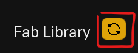
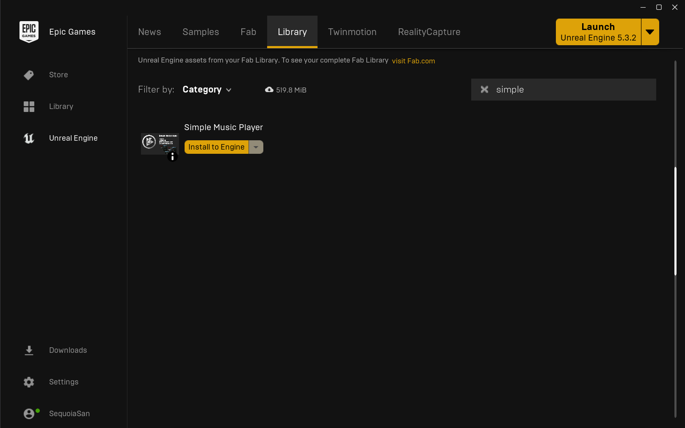
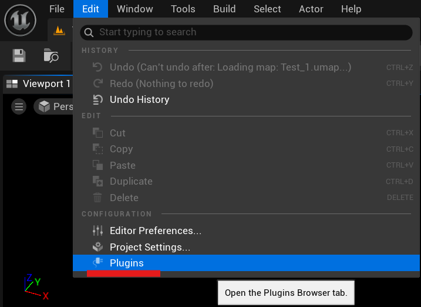
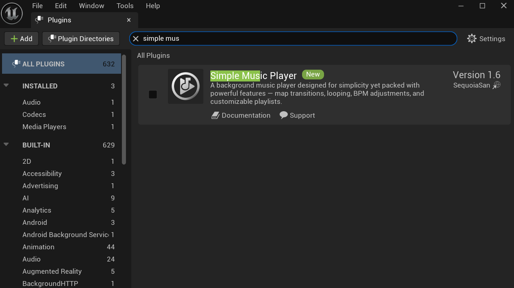
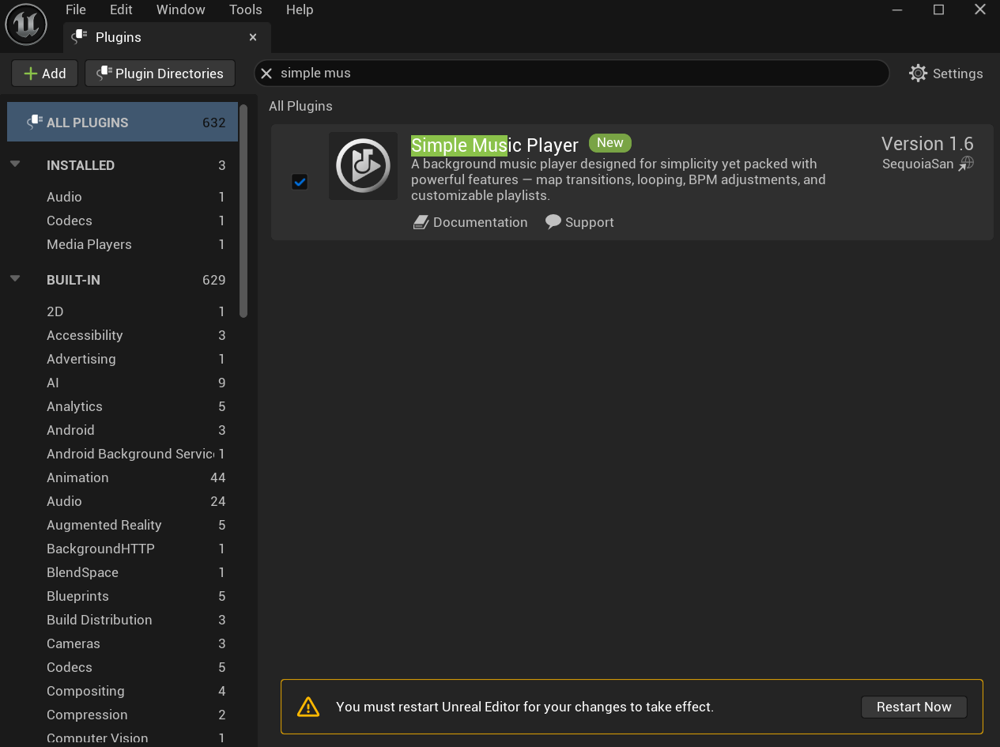

# Quick Start Guide

## Plugin Installation

1. Go to your Epic Games Launcher and open Unreal Engine tab on the left.
2. Proceed to Library tab (on top)
3. Scroll to the bottom of the page to Fab Library section (optionally click on refresh icon)

4. Type in search box "Simple Music Player". You should see plugin in the list.

5. Click on "Install to Engine" button near plugin.
6. Choose to which Unreal Engine version you want to install plugin.

**Congratulations! You installed the plugin!**

## Enable Plugin in Project

1. Open your project (note, your project should be using same Unreal Engine version in which you installed plugin)
2. Open menu "Edit" on the top. Choose "Plugins"

3. In a search box on the top of plugin manager type in `Simple Music Player`
4. Now you should see plugin in the list.

5. Tick box on the left of the plugin. Now Unreal Engine would ask you to restart the editor to apply your changes.

6. Restart Unreal Engine editor.

**Congratulations! You enabled Simple Music Plugin in your project!**

## Plugin Usage

We provide a small start example of how this plugin can be used, but it's not the only way. Plugin can be used almost in any kind of blueprint.

1. Create a `SoundCue` file with music

2. Open level blueprint

3. Right click on free space in level blueprint and type "Get SimpleMusicPlayer"

4. Add node `Get SimpleMusicPlayer`

5. Grab an output of newly created SimpleMusicPlayer node and drop it somewhere in level blueprint
6. In opened submenu start typing "Play Cue"

7. Add node `Play Cue`

8. Grab execution node from `Event BeginPlay` event of level blueprint and attach it to `Play Cue` execution node

9. In Play Cue's "Cue" drop-down field find your SoundCue and choose it

10. Now hit play in Unreal Engine Editor and you should hear your soundCue play.

**Congratulations! You made it!**

Please, refer to our documentation to find out what all inputs in nodes do and what other nodes exist.
Also, check out our YouTube guide series on Simple Music Player to see its usage in action.