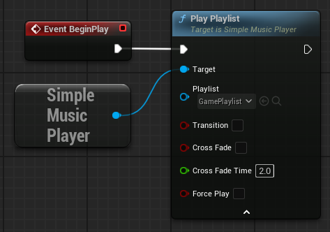
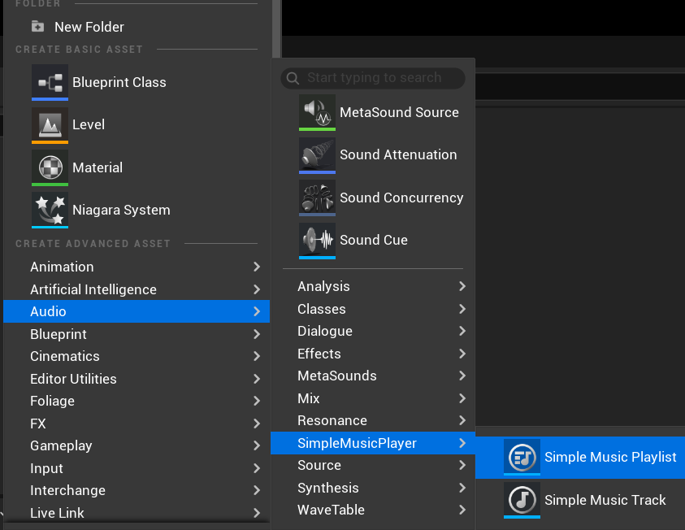
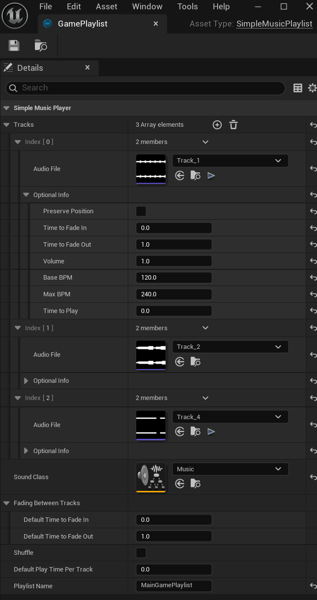
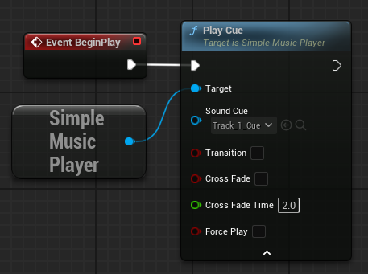
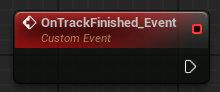
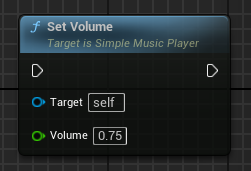

# Simple Music Player (Version 1.6)

A plugin for Unreal Engine designed to provide a straightforward background music player. With this plugin, you can trigger music tracks from anywhere in Blueprints, offering a seamless audio experience for your game.

### Features
- Continuous playback across maps without interruptions
- Variable real-time BPM (beats per minute) control without affecting pitch
- Playlist support
- Shuffle functionality
- Customizable track duration
- Smooth fade-out\crossfade transitions between tracks

The **Simple Music Player** includes three primary nodes:
- **Play Track**: Plays a single track
- **Play Playlist**: Plays a predefined playlist
- **Play Cue**: Plays a prepared Sound Cue (simplified mode, no variable BPM support)

---
Refer to our quick start guide to get started quickly.
# [> Quick Start Guide](QUICKSTART.md)

---

# Node Description

---

## Play Track

Designed to play a single track using a `Simple Music Track`.

### Node Inputs
- **Track Class**: Assign track created from the menu `Audio -> SimpleMusicPlayer -> Simple Music Track`.
- **Loop**: If enabled, the track loops indefinitely.
- **Transition**: If enabled, the track continues playing across map/level changes without restarting.
- **Cross Fade**: If enabled, the track starts to fade in while the previous one starts to fade out.
- **Cross Fade Time**: Specifies the duration (in seconds) for the crossfade transition to complete.
- **Force Play**: If enabled, the track will restarts from the beginning when node executed, even if `Transition` is active.

### Creating a Simple Music Track
The `Simple Music Track` can be found here:  

A newly created `Simple Music Track` has this thumbnail:  

#### Simple Music Track Structure and Options

- **Audio File**: Select the desired Wave asset.
- **Optional Info**:
  - **Volume**: Set the playback volume (0.0 to 1.0).
  - **Base BPM**: Define the track's base beats per minute.
  - **Max BPM**: Set the maximum BPM for variable speed playback.
  - **Time To Play**: Specify the duration (in seconds) the track plays. Ignored if `Loop` is enabled.
  - **Sound Class**: Assign a Sound Class to this track for audio mixing.

---

## Play Playlist

Designed to play a sequence of tracks from a `Simple Music Playlist`.

### Node Inputs
- **Playlist**: Assign a playlist created through menu `Audio -> SimpleMusicPlayer -> Simple Music Playlist`
- **Transition**: If enabled, the playlist continues across map/level changes without restarting.
- **Cross Fade**: If enabled, the track starts to fade in while the previous one starts to fade out.
- **Cross Fade Time**: Specifies the duration (in seconds) for the crossfade transition to complete.
- **Force Play**: If enabled, the playlist restarts from the beginning when node executed, even if `Transition` is active.

### Creating a Simple Music Playlist
The `Simple Music Playlist` can be found here:  

A newly created `Simple Music Playlist` has this thumbnail:  

#### Simple Music Playlist Structure and Options

- **Audio File**: Select the desired Wave asset.
- **Optional Info**:
  - **Preserve Position**: If enabled - during shuffle, this track retains its position in the playlist. Useful for ensuring a specific track (e.g., an intro) always plays first.
  - **Time to Fade In**: Specifies the time (in seconds) for the track to fade in when it starts playing.
  - **Time to Fade Out**: Specifies the duration (in seconds) for the track to fade out when transitioning to another track.
  - **Volume**: Set the playback volume (0.0 to 1.0).
  - **Base BPM**: Define the track's base beats per minute.
  - **Max BPM**: Set the maximum BPM for variable speed playback.
  - **Time To Play**: Duration (in seconds) the track loops.
- **Sound Class**: Assign a Sound Class to each track from playlist for audio mixing.
- **Fading Between Tracks**:
  - **Default Time to Fade In**: Specifies the default duration (in seconds) for a track to fade in when it starts playing. This value can be overridden by the track's optional fade-in time setting.
  - **Default Time to Fade Out**: Specifies the default duration (in seconds) for a track to fade out when transitioning to another track. This value can be overridden by the track's optional fade-out time setting.
- **Shuffle**: Shuffles the tracks in the playlist.
- **Default Play Time Per Track**: Specifies the default duration (in seconds) for each track to play. This value can be overridden by the track's optional 'Time To Play' setting.

---

## Play Cue

Designed to play a single track using a standard Unreal Engine Sound Cue.  
**Note**: This mode does not support variable BPM.

This is the simplest option, ideal for game jams or projects with minimal audio needs.

- **Transition**: If enabled, the cue continues across map/level changes without restarting.
- **Cross Fade**: If enabled, the cue starts to fade in while the previous one starts to fade out.
- **Cross Fade Time**: Specifies the duration (in seconds) for the crossfade transition to complete.
- **Force Play**: If enabled, the cue restarts from the beginning when node executed, even if `Transition` is active.

---

## Using the Transition Parameter

The `Transition` parameter ensures music persists across level or map changes without restarting. For example:
- **Scenario**: You have a Main Menu map and three level maps. You want the Main Menu music to play only in the Main Menu, but a Main Theme to play continuously across all three levels without reloading.
- **Setup**:
  - In the Main Menu, use a `Play Track` node with the Main Menu track and `Transition` disabled.
  - In each level map, use a `Play Track` node with the Main Theme track and `Transition` enabled.

### How Transition Works
- When `Transition` is enabled, the node checks the currently playing track, playlist, or cue:
  - If it matches the new node's input, playback continues uninterrupted.
  - If it differs, the previous audio stops, and the new audio starts.
- **Compatibility**: `Transition` only works within the same node type (e.g., `Play Track` with `Play Track`). Mixing node types (e.g., `Play Track` with `Play Playlist`) restarts playback.
- **Matching Logic**:
  - `Play Track`: Compares the audio file.
  - `Play Playlist`: Compares the `SimpleMusicPlaylist` name.
  - `Play Cue`: Compares the Sound Cue file.

---

## OnTrackFinished Event

The `OnTrackFinished` event triggers when a track completes or is stopped.  
**Note**: Tracks set to loop indefinitely will not fire this event.

## Events

### On Track Finished
Only works on non looped tracks

### On Fade Finished
Trigger when Fade In or Fade Out completed

### On Cross Fade Finished
Trigger when cross fade completed

---

## Additional Nodes

### Set Volume
Adjusts the volume of the currently playing track.

### Pause
Pauses the current music playback.

### Resume
Resumes paused music playback.

### Stop
Stops the current music playback entirely.

### Set Max BPM
Sets the maximum BPM for the currently playing track.

### Set New BPM
Immediately sets the BPM to a specific value for the current track.

### Set New BPM Normalized
Adjusts BPM in real-time between `Base BPM` and `Max BPM` using a normalized input (0.0 to 1.0). Applies to the **CURRENT** track (`Play Track`) or in  **CURRENT** track in the playlist (`Play Playlist`).

### Set New Permanent BPM Normalized
Adjusts BPM in real-time between `Base BPM` and `Max BPM` using a normalized input (0.0 to 1.0). Applies to the track (`Play Track`) or tracks in the playlist (`Play Playlist`) and any future tracks.

### Play Next
Play next track in current playlist

### Fade Out
Fade out current track. Fade out input in seconds

### Fade In
Fade In current track. Fade in input in seconds

---
